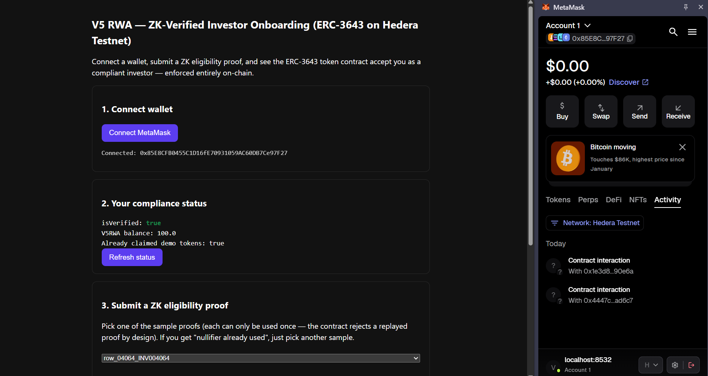
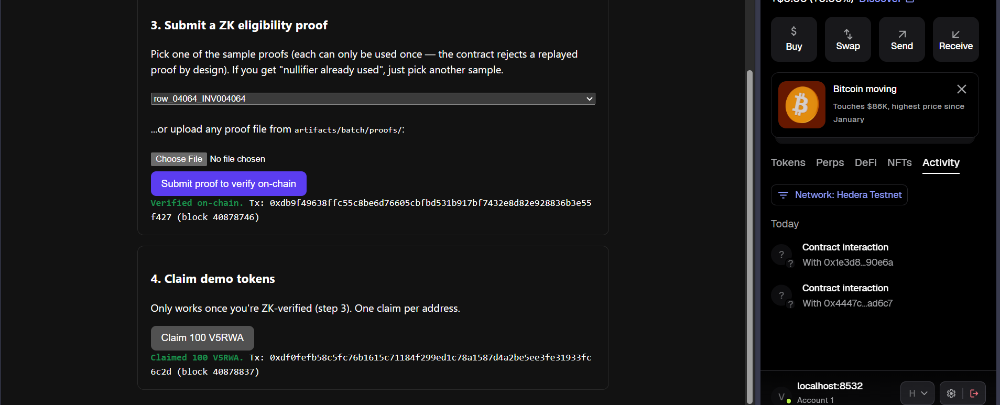
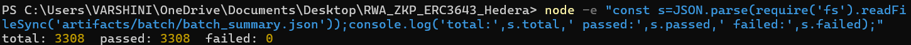
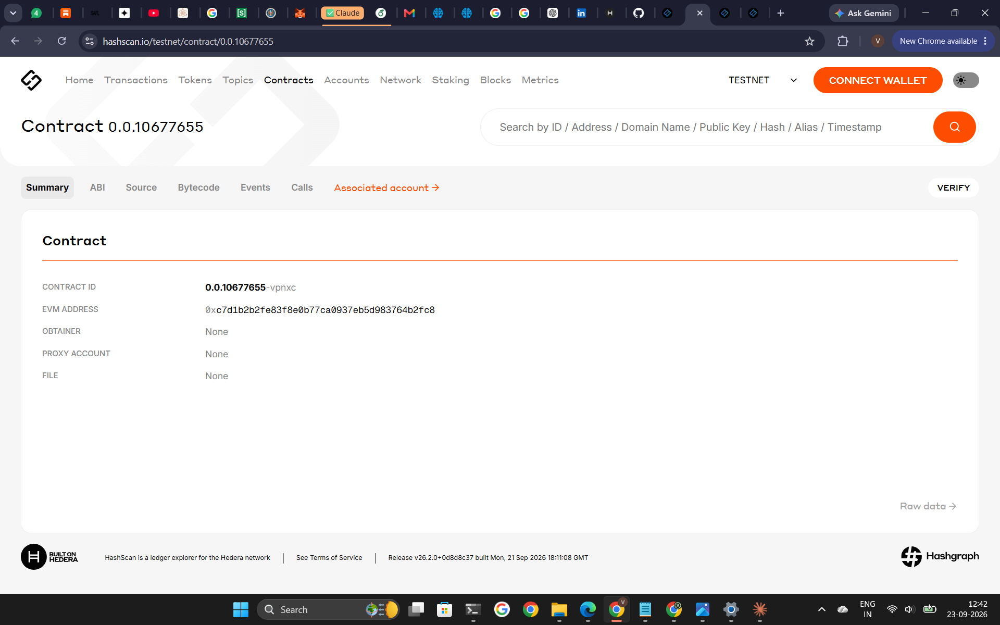
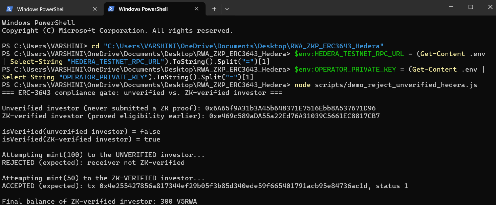
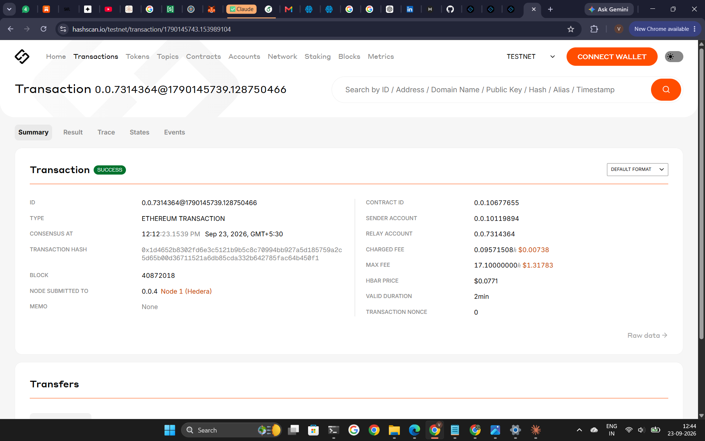
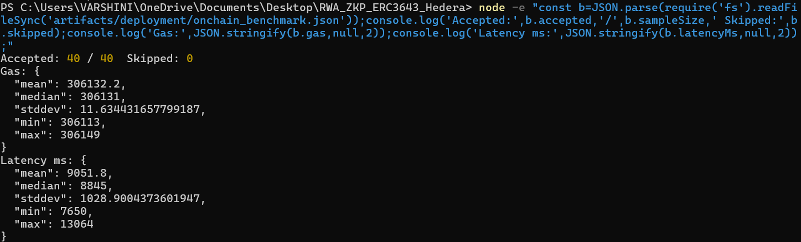

# V5 ZKP + ERC-3643 Eligibility Proof System for Hedera RWA Tokenization

This project adds a privacy-preserving, ZK-proof-gated ERC-3643 compliance
layer to the Hedera-based RWA (Real-World Asset) tokenization platform
described in the base paper *"A Real-World Fractional Assets Tokenization
Platform using Hedera: SAMK Framework"* (included at
`../RWA/A_Real-World_Fractional_Assets_Tokenization_Platform_using_Hedera_SAMK_Framework (1).pdf`
in the parent `RWA` folder).

The base paper tokenizes fractional real-world assets on Hedera using an
OpenZeppelin ERC-1155 contract, with investor KYC handled off-chain and no
on-chain, privacy-preserving compliance check. **This project is the
extension**: an investor's eligibility (from the V5 synthetic investor
dataset) is proven with a zero-knowledge proof, and that proof is what gates
whether an ERC-3643-compliant token contract will mint/transfer to that
investor — without ever putting the investor's raw attributes on-chain.

## What this project actually does, end to end

```
V5 investor CSV (off-chain, never copied into this repo)
        |
        v
circom circuit (eligibility_label == 1, Poseidon commitment + nullifier)
        |
        v
Groth16 proof, generated + verified locally with snarkjs
        |
        v
Groth16Verifier.sol (generated by snarkjs) deployed on Hedera Testnet
        |
        v
ZKPVerifierRegistryBytesV2.sol verifies the proof on-chain, then acts as
an ERC-3643 "agent": registers the investor in IdentityRegistry.sol
        |
        v
RWAToken.sol (ERC-3643 interface) checks identityRegistry.isVerified(to)
before allowing mint/transfer — an unverified investor is rejected, a
ZK-verified investor is accepted
```

## Repository layout

- `config/` — dataset path and ZKP claim configuration. The raw CSV is kept
  in place at `../RWA/synthetic_investor_dataset.csv` and is never copied
  into this repo; scripts read it only through `config/dataset_config.json`.
- `circuits/` — the circom circuit (`v5_eligibility.circom`).
- `contracts/` — `ZKPVerifierRegistryBytesV2.sol` (the ZK-verification +
  ERC-3643 agent contract) and earlier registry iterations kept for
  reference (see `contracts/README.md` for which one to actually deploy).
  `contracts/erc3643/` holds the ERC-3643 interfaces (`IERC3643`,
  `IIdentityRegistry`, `ICompliance`, signatures taken directly from
  EIP-3643) and their implementations (`IdentityRegistry.sol`,
  `Compliance.sol`, `RWAToken.sol`).
- `scripts/` — every operational script, listed in Usage below.
- `docs/` — specifications, workflow notes, deployment guide, and
  `docs/screenshots/` (the result evidence embedded below).
- `artifacts/` — generated outputs. Bulky/regenerable files (proving key,
  witnesses, individual per-row proofs) are gitignored; small result files
  (deployment records, verification key, batch summary) are committed as
  evidence.
- `tests/` — required test coverage checklist.

## Why a ZK proof instead of plain KYC data on-chain

The circuit proves the statement *"this investor's eligibility label equals
1, their credential is not expired, and here is a nullifier that stops this
exact credential being reused"* — without revealing the investor's raw V5
attributes, Aadhaar/PAN data, or identity. Only a Poseidon commitment and a
nullifier are public. This is what `docs/zkp_spec.md` specifies.

**Honesty note carried over from the project's own docs:** the circuit
currently proves the placeholder rule `eligibility_label == 1`, i.e. it
re-proves a label that already exists in the plaintext CSV. It is not yet
the final, audited eligibility policy — see `docs/next_steps.md`. The proof
plumbing (generation, on-chain verification, replay/tamper rejection) is
fully working and proven below; the eligibility *rule* itself is still
provisional by design.

## ERC-3643 integration — what's real and what's simplified

`contracts/erc3643/IERC3643.sol`, `IIdentityRegistry.sol`, and
`ICompliance.sol` are written to the exact function signatures and events
published in [EIP-3643](https://eips.ethereum.org/EIPS/eip-3643) — not a
loose approximation. `IdentityRegistry.sol` and `RWAToken.sol` implement
those interfaces directly, and `IdentityRegistry.isVerified(address)` is the
same function any ERC-3643-compliant token would call before a transfer.

The one deliberate simplification: the reference ERC-3643 implementation
(T-REX) verifies claims held in a per-investor OnchainID contract, issued by
trusted claim issuers. This project substitutes that claim inspection with
the ZK proof itself — `ZKPVerifierRegistryBytesV2.sol` is set as an
authorized "agent" on `IdentityRegistry`, and calls `registerIdentity(...)`
only once a Groth16 proof of eligibility has verified on-chain. No
per-investor OnchainID/claim contracts are deployed. This is a legitimate
design choice (arguably a stronger privacy story than standard ERC-3643),
not an attempt to claim the full production T-REX suite was used.

## Setup

```powershell
npm install
```

Also needs `circom` (2.1.6+) installed and on PATH for circuit compilation.

## Usage

```powershell
# 1. Compile the circuit
npm run compile:circuit

# 2. Prepare one private-input JSON per eligible investor row
python scripts/batch_prepare_inputs.py

# 3. Generate + locally verify a proof for every eligible row
node scripts/batch_prove.js

# 4. Compile the Solidity contracts (verifier + ERC-3643 stack)
npm run compile:contracts

# 5. Deploy the full ERC-3643 stack to Hedera Testnet
#    (needs HEDERA_TESTNET_RPC_URL and OPERATOR_PRIVATE_KEY in .env —
#    see .env.example and docs/DEPLOY_HEDERA.md)
npm run deploy:erc3643

# 6. Demonstrate the compliance gate: mint rejected for an unverified
#    investor, accepted once they submit a ZK proof
npm run demo:erc3643 -- row_00050_INV000050.json

# 7. Benchmark on-chain verification gas/latency over a sample of proofs
npm run benchmark:hedera 40
```

Full deployment instructions: `docs/DEPLOY_HEDERA.md`.

## Deployed contracts (Hedera Testnet)

Full ERC-3643 stack — `artifacts/deployment/hedera_testnet_erc3643.json`:

| Contract | Address | Hedera ID |
|---|---|---|
| IdentityRegistry | `0x654144ba97D32b06B37A2E5db540C4fbb788f9C2` | `0.0.10677632` |
| Compliance | `0x0829a3bd4C8a9EEC1CEA7731CC8EDa20242E39ec` | — |
| Groth16Verifier | `0xcAE02778b1b935F226fc3526a07eC4Bfb0A5d909` | — |
| ZKPVerifierRegistryBytesV2 | `0x4447c6cea10fcdC88b3B61b05657B7061A7AD6C7` | — |
| RWAToken (ERC-3643) | `0x1e3D8daAe4164233c9BAe250A57D4CdA9cf90E6A` | — |

(`RWAToken` was redeployed once after the initial deployment to add
`claimDemoTokens()` for the wallet-connected demo below; `Compliance` was
rebound to the new address. `IdentityRegistry`, `Compliance`,
`Groth16Verifier`, and `ZKPVerifierRegistryBytesV2` are unchanged.)

Look up any of these on [HashScan Testnet](https://hashscan.io/testnet) by
pasting the address into the search bar.

## Live wallet-connected demo

`frontend/index.html` is a static page where a real MetaMask wallet can
connect, submit a ZK proof, and claim ERC-3643-gated tokens directly against
the deployed contracts above — no terminal, no private key pasted anywhere.
See `frontend/README.md` for how to run it.

This was run live end to end with a real MetaMask wallet
(`0x85E8CFB0455C1D16fE70931059AC60DB7Ce97F27`) on Hedera Testnet: connect →
submit a ZK proof → `isVerified` flips to `true` → claim 100 `V5RWA` tokens.
Both steps produced real, independently checkable transactions:

- ZK proof verified on-chain: tx
  `0xdb9f49638ffc55c8be6d76605cbfbd531b917bf7432e8d82e928836b3e55f427`
  (block 40878746)
- Demo tokens claimed: tx
  `0xdf0fefb58c5fc76b1615c71184f299ed1c78a1587d4a2be5ee3fe31933fc6c2d`
  (block 40878837)





The right-hand panel in both screenshots is MetaMask's own Activity tab,
independently confirming the same two contract interactions — the page
isn't just displaying claimed results, the wallet itself recorded them as
real transactions.

## Results

**1. Local proof generation and verification — the whole eligible dataset.**
Every eligible row of the V5 dataset (3,308 of 5,000 total investors) got a
Groth16 proof generated and verified locally with `snarkjs`, independent of
the blockchain:



**2. IdentityRegistry deployed on Hedera Testnet:**


**3. RWAToken (ERC-3643) deployed on Hedera Testnet:**



**4. A ZK eligibility proof verifying on-chain:**


**5. The core result — ERC-3643 compliance gated by the ZK proof.**
`mint()` to an investor who has not submitted a ZK proof is rejected by the
`RWAToken` contract itself (`receiver not ZK-verified`); the same call for
an investor who has proven eligibility succeeds:





**6. On-chain verification cost and latency**, benchmarked over 40 proofs
spread evenly across the full 3,308-proof dataset (not just the first 40),
each checked against a fresh, previously-unused nullifier:



| Metric | Gas used | Latency |
|---|---|---|
| Mean | 306,132 | 9,052 ms |
| Median | 306,131 | 8,845 ms |
| Std dev | 11.6 | 1,028.9 ms |
| Min | 306,113 | 7,650 ms |
| Max | 306,149 | 13,064 ms |

Gas is essentially constant across every proof (same fixed Groth16 pairing
check every time); latency variation comes from Hedera network conditions,
not the contract.

**7. Negative tests** (`artifacts/deployment/negative_test_results.json`) —
required by `tests/README.md`:
- A second, different valid proof → **accepted**.
- The same proof replayed a second time → **rejected**: `Nullifier already used`.
- A proof with one digit of the Groth16 proof tampered → **rejected**: `Invalid ZK proof`.

## Future work

- Replace the circuit's current provisional rule (`eligibility_label == 1`)
  with an independently audited eligibility policy, once the V5
  target-generation methodology and leakage audit referenced in
  `docs/next_steps.md` are finalized.
- Extend the negative-test suite to cover an expired credential and a wrong
  token ID (the circuit and contracts already support both checks; the
  proof-of-concept ones run so far are replay and tamper rejection).
- Optionally extend `IdentityRegistry` with per-investor OnchainID/claim
  contracts to align fully with the reference T-REX implementation — see the
  ERC-3643 section above for the current design and its trade-offs.

## Base paper

S. Jain, M. Shirure, A. Bedi, and K. Kushwaha, *"A Real-World Fractional
Assets Tokenization Platform using Hedera: SAMK Framework,"* 2026 IEEE
International Conference on AI Engineering and Innovations (AIEI), DOI:
10.1109/AIEI69164.2026.11496813. This project extends that platform's
architecture with the ZKP + ERC-3643 layer described above; the base paper
itself uses ERC-1155 with off-chain KYC and does not implement ERC-3643 or
any ZK proof.
